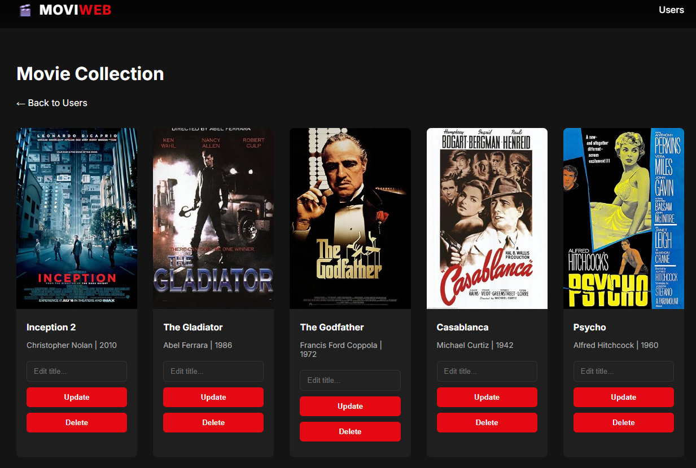

# 🎬 MoviWebApp

## Table of contents
* [General info](#general-info)
* [Technologies](#technologies)
* [Features](#features)
* [OMDb API Integration](#omdb-api-integration)
* [Setup](#setup)
* [Usage](#usage)
* [Requirement file](#requirement-file)
* [Project Purpose](#project-purpose)

## General info
🎬 Built a Movi Web App that allows users to browse and manage movie data through an interactive interface, leveraging the OMDb API to fetch real-time movie details.

Utilized Python (Flask) for backend logic, SQLAlchemy/SQLite for database management, OOP-based DataManager and models for clean CRUD operations, and dynamic HTML/CSS templates, delivering a maintainable, data-driven, and user-friendly web application.



## Technologies
* Project is created with: Python version: 3.14
* Libraries:
  * Flask
  * requests
  * python-dotenv
* HTML/CSS templates for dynamic page rendering
* External OMDb API
* .env file for storing API key securely

## Features
* CRUD operations:
   * Create → Add new movies
   * Read → View existing movies
   * Update → Edit movie details
   * Delete → Remove movies
   * All CRUD operations are implemented in data_manager.py and exposed via Flask routes in app.py
* Modular structure:
   * app.py → main server and route handling
   * data_manager.py → movie data retrieval & processing
   * models.py → data structures
   * Dynamic HTML pages for movie details
* Display movie information:
   * Title
   * Genre
   * Release Date
   * Rating
   * Synopsis
* Error handling:
   * If no movie is found → show styled message in the website
* Use environment variables for OMDb API key security
* Requirements file for easy setup

## OMDb API Integration
* Uses the OMDb API to fetch real-time movie information
* Requires a personal API key from OMDb

Example:
````
import os
import dotenv import load_dotenv

load_dotenv()
OMDB_API_KEY = os.getenv("OMDB_API_KEY")

````
## Setup
1. Clone the repository and install dependencies:
````
   git clone https://github.com/jess-compliance-dev/MoviWebApp.git
   cd MoviWebApp
   pip install -r requirements.txt
````
2. Make sure Python 3.14+ is installed:
````
   $ python --version
````
3. Create a .env file in the root folder and add your OMDb API key:
````
    OMDB_API_KEY=insert_your_API_key_here
````

## Usage
Run the application:
````
$ python app.py
````
Open your browser at:
````
http://localhost:5000
````
If a movie doesn't exist, a styled error message will be displayed on the page

## Project Purpose
This project is designed for learning:
   * Working with APIs in Python (OMDb API)
   * Using environment variables (.env) for secure keys
   * Structuring Python projects into modules
   * Building web applications with Flask
   * using OOP
   * SQLAlchemy/ SQLite for database management
   * Generating HTML dynamically
   * Handling CRUD operations
   * Error handling and fallback messages
   * Using Git & GitHub
   * Managing dependencies with requirements.txt

## Requirement file
requirements.txt contains:
   * Flask
   * requests
   * python-dotenv

To install dependencies:
````
   pip install -r requirements.txt
````
